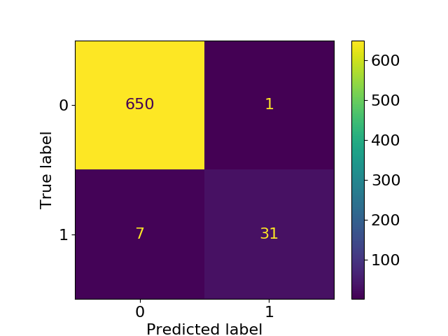

# **Pathogenicity Predictor for Mitochondrial SNVs**
# For tRNA coding gene and Missense protein coding gene


## Notice
* I hardcoded every input files required (as well as the output files) to run the process. If you want to use custom file paths, you need to change it manually in the code.
* You will need to download manually the newer database files (and thus need to change the file paths in the scripts).

## Brief

This is a pathogenicity predictor of Mitochondrial SNV(Single Nucleotide Variation)s. Different regions of DNA are accounted for different functions. This work only considers two types of regions:
1. tRNA coding region
2. Pretein coding region under the condition that the variant is non-synonymous.


## Performance

The LGBM model for tRNA coding alleles reached 98% specificity and 96% sensitivity on the dataset attached in MitoTIP's paper (https://doi.org/10.1371/journal.pcbi.1005867). This is much more better than the original single value cutoff prediction method in the paper, due to the improvement of the MitoTIP score and other aiding features.



This is unfortunately the only dataset that I can found to evaluate the model performance, and is for tRNA coding regions only.

Other confusion matrix graphs on validation set (randomly splitted from ClinVar labels) in the `img/` directory are for reference only, as it is clear that the data is insufficient. The image names specify the information.


## Process

The workflow is described as follows:

1. Preprocessing

    Preprocessing is needed to feed the features and labels to the machine learning model. In this work, labels(correct answers) of pathogenicity come from the ClinVar database; Features come from MITOMAP (https://www.mitomap.org/foswiki/bin/view/MITOMAP/WebHome), gnomAD (https://gnomad.broadinstitute.org/), PhyloTree (https://www.phylotree.org/), and MitImpact 3D (https://mitimpact.css-mendel.it/).

    The "tree level" value is extracted from PhyloTree and used as the training feature (for PhyloTree). For an SNV, the "tree level" is calculated as follows:
    * If the SNV appears on the tree, find out on which level it appears. If more than 1  is found, return the average level of the appearance.
    * If the SNV does not appear on the tree, an highest level (25) is returned under the assumption that the SNV is too rear to be on the tree.
    
    The thought that this tree level value can be used as a feature is based on assumption that the PhyloTree level is related to the pathogenicity of SNVs, as closer to the tree root means the variant is more common, and thus has less chance to be pathogenic.


2. Model Generation

    * for tRNA Coding Region
        
        SNVs with ClinVar pathogenicity labels is used as the training dataset. The features include MitoTIP score, allele frequency, homoplasmy/heteroplasmy frequency, and PhyloTree level value.
    
        LGBMClassifier from LightGBM(https://lightgbm.readthedocs.io/en/latest/index.html) is chosen as the machine learning model.

        To generate the prediction model, run:
        ```
        python3 train_tRNA_lgbm.py
        ```
    
    * for Protein Coding Region

        LGBMClassifier is chosen as the machine learning model. The features include scores collected in MitImpact database, allele frequency, homoplasmy/heteroplasmy frequency, and PhyloTree level value.

        To generate the prediction model, run:
        ```
        python3 train_missense_pcg_lgbm.py
        ```


3. Prediction

    * for tRNA Coding Region

        To generation preciction file, run:
        ```
        python3 predict_tRNA.py
        ```

    * for Protein Coding Region

        To generation preciction file, run:
        ```
        python3 predict_missense_pcg.py
        ```

## How to Run

1. Preprocessing

    * MitoTIP score and GenBank frequency
        1. Download the score file at https://www.mitomap.org/downloads/mitotip_scores.txt , and the frequency file at https://mitomap.org/cgi-bin/polymorphisms.cgi into /`downloads/` directory.
        2. Run `do_MITOMAP.py` file in the `src_preprocessing/` directory.
    * MitImpact
        1. Download the MitImpact database file (https://mitimpact.css-mendel.it/cdn/MitImpact_db_3.0.6.txt.zip) into `downloads/`, unzip it and change the extension to .tsv.
        2. Run the `do_MitImpact.py` file in the `src_preprocessing/` directory.
    * gnomAD allele homoplasmy/heteroplasmy frequency
        1. Download the gnamAD database file at https://gnomad.broadinstitute.org/downloads#v3-mitochondrial-dna into `downloads/`.
        2. Run the `do_gnomAD.py` file in the `src_preprocessing/` directory.
    * PhyloTree level value
        1. Download the MitImpact database file at https://www.phylotree.org/builds/mtDNA_tree_Build_17.zip into `downloads/`, unzip it.
        2. Run the `do_PhyloTree.py` file in the `src_preprocessing/` directory. This generates the json file of [SNV]-[level(s) of occurence] pairs
        3. Run the `do_PhyloTree_score.py` filein the `src_preprocessing/` directory. This gerates the json file of the average level score.

    See [Files](#files) for more information on the files generated from the above scripts.


2. Training & Prediction
    
    To train the machine learning model and use it for prediction, see the Training and Prediction sub-section in the [Process](#process) section.


## Files
* `data/`
    * Label files
        * `MitImpact_preprocessed`: preprocessed MitImpact file. Useless columns are removed and cell values are turned into numbers.
        * `Mit_gene_function_list.csv`: This file describes the functions of mito. gene regions, i.e., which region is for tRNA coding...
        * `label_clinvar.json`: Pathogenicity labels of mito. SNVs extracted from ClinVar database
        * `label_clinvar_tRNA.json`: Pathogenicity labels of tRNA coding region filtered from `label_clinvar.json`
    * Feature files
        * `mitoTIP_score.json`: MitoTIP scores for tRNA coding region SNVs. This is from MITOMAP database.
        * `gbfreq_count.json`: GenBank allele frequency of polymorphisms. This is also from MITOMAP.
        * `gnomad_freq.json`: gnomAD homoplasmy/heteroplasmy frequency.
        * phylotree_score.json: PhyloTree level values

* `src_preprocessing/`
    * This directory contains the preprocessing codes that extract features from original downloaded files from databases.

* `train_tRNA_lgbm.py`
    * This is the python script file that gererates the LGBM model for tRNA coding genes.
* `train_missense_pcg_lgbm.py`
    * This is the python script file that gererates the LGBM model for missense protein coding genes.


## Contact

* Chien Lee: contributor of this work.
    * lee1003094395@gmail.com
* Dr. Ni-Chung Lee: advisor of this work.
    * ncleentu@ntu.edu.tw

